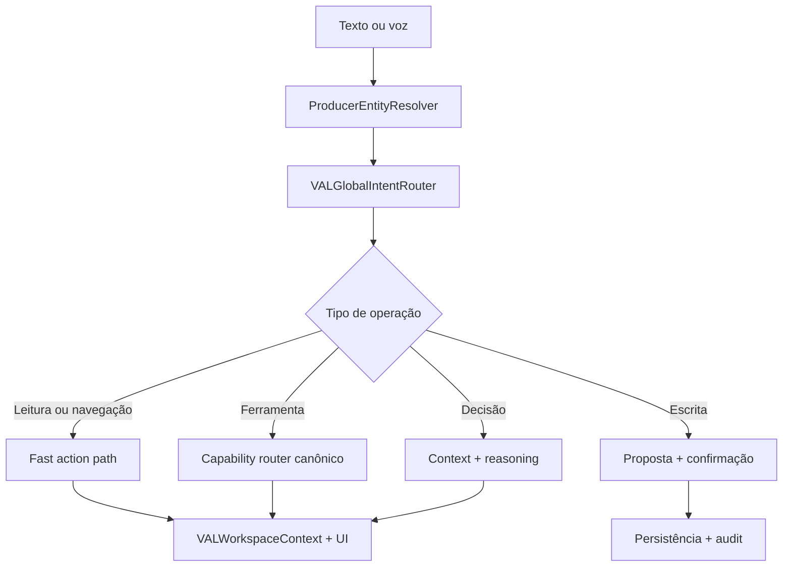

# VAL Conversational Operating System vNEXT — Architecture v1

Data da auditoria: 2026-08-29
Branch de trabalho: `feature/val-conversational-os-vnext`
Base congelada: `9267c28eceef405aa52d71700af9f4c5f409c4e6`
Tree base: `eabbdb9d5d8d31ad55a6af4ec90090789656c7a5`

## Resultado arquitetural

A evolução mantém uma única VAL e os módulos canônicos existentes. Voz e texto entram pelo mesmo Copilot, passam por resolução de entidade e roteamento global, e acionam adapters governados. Não foi criado um cérebro paralelo, uma segunda fórmula ou uma segunda memória.

## Componentes

| Componente | Contrato | Responsabilidade |
|---|---|---|
| ProducerEntityResolver | `val.producer_entity_resolver.v1` | Resolver somente produtores previamente autorizados; normalizar, desambiguar e corrigir pequenas variações de transcrição. |
| Producer entity index | `val.producer_entity_index_cache.v1` | Cache leve por tenant + owner, TTL de 30 s, sem dossiê e sem conteúdo nas métricas. |
| Global intent router | `val.global_intent_router.v1` | Classificar ASK/OPEN/SEARCH/PREPARE/REGISTER/UPDATE/CREATE/CALCULATE/ANALYZE/NAVIGATE/FOLLOW_UP/COMPARE/SHOW/EXPLAIN/MARK_COMPLETE. |
| Workspace action | `val.workspace_action.v1` | Descrever apenas ações allowlisted de leitura/navegação; nunca executar write diretamente. |
| Workspace context | `val.workspace_context.v1` | Sincronizar módulo, cliente e objetos ativos entre App e Copilot. |
| Capability router | existente | Reusar calculadoras, mercado, agronomia, anexos, PrepareVisit e demais capacidades canônicas. |
| Conversation state | `val.conversation_state.v1` | Preservar o estado global e limpar dependências específicas quando o produtor muda. |
| Realtime Voice | `val.realtime_voice.session.v1` | WebRTC, semantic VAD, streaming, barge-in, ferramenta governada e fallback push-to-talk. |

## Segurança e tenancy

- O índice e a consulta SQL são escopados por `tenant_id` e `consultant_id`, com `status='active'`.
- IDs, nomes, aliases e propriedades enviados pelo browser não concedem autoridade.
- A UI revalida `workspace_action` contra uma allowlist e contra `clientList` da sessão autenticada.
- A troca de produtor limpa propriedade, talhão, visita, oportunidade, facts, hypotheses, ferramentas e turnos específicos do cliente anterior.
- Apenas referências mínimas de clientes recentes sobrevivem à troca, permitindo “volta para o produtor anterior” sem levar fatos junto.
- REGISTER e demais writes permanecem sob confirmação humana; memória automática continua proibida.
- Ferramentas Realtime passam pelo mesmo `/api/val/chat` governado.

## Performance

- A entidade é resolvida antes de carregar contexto profundo.
- O índice leve é pré-aquecido após `/api/intelligence`.
- Após OPEN/SEARCH autorizado, o `ContextSnapshot` é pré-carregado em background pelo cache existente.
- Ações OPEN/NAVIGATE/PREPARE usam caminho FAST e não executam MIA/MCA/MDI/MVV.
- A telemetria de servidor passou a separar `ENTITY` de `INTENT`.

## Limites conhecidos

- Navegação para outra página encerra a superfície full-screen atual; uma sessão hands-free persistente entre páginas ainda não tem evidência física.
- Filtros complexos de Clientes e updates de compromissos não possuem adapter operacional completo.
- iPhone, Android, ruído real e corte de áudio após tuning precisam de UAT físico.
- Esta árvore ainda não foi publicada nem implantada; o Railway continua no SHA-base.
