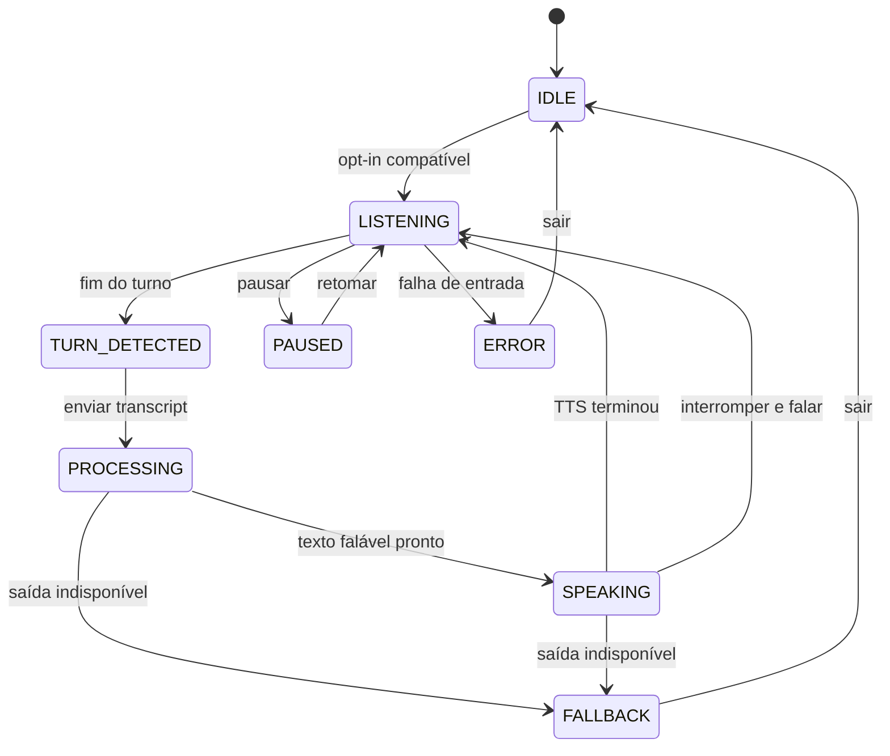

# VAL Realtime Voice Conversation v1

Versão: `val.realtime_conversation.v1`.

Status: implementação local disponível para regressão. A aprovação de microfone, áudio, interrupção e comportamento mobile continua condicionada a navegador e dispositivos físicos reais.

## Objetivo e limite do nome “realtime”

O modo conversa encadeia turnos de voz na mesma conversa da VAL: ouvir, detectar o fim da fala, processar, falar a resposta e voltar a ouvir. Ele exige opt-in explícito e pode ser encerrado a qualquer momento.

“Realtime” nesta versão não significa áudio em streaming, WebSocket, resposta token a token, full duplex ou microfone aberto enquanto a VAL fala. A implementação é alternada e baseada nas APIs Web Speech do navegador:

```text
captura de um turno -> transcript final -> /api/val/chat -> resposta textual completa -> TTS do navegador -> novo turno
```

O primeiro áudio só pode começar depois que um texto falável estiver disponível. Não há TTS progressivo nem TTS no servidor.

## Implementação canônica

| Responsabilidade | Arquivo |
|---|---|
| contrato, estados e provider de entrada | `src/lib/realtime-conversation.js` |
| coordenação React, TTS, rearm e métricas | `src/hooks/useRealtimeConversation.js` |
| interface, indicadores e fallback | `src/components/copilot/ValRealtimeConversation.jsx` |
| reprodução browser-native | `src/hooks/useSpeechSynthesis.js` |
| integração com a conversa principal | `src/components/GlobalValCopilot.jsx` |
| agregação de latência sem conteúdo | `server/decision-copilot/conversation-latency.js` |
| testes automatizados do contrato | `test/val-realtime-conversation-v1.test.js` |

## Política executável

`REALTIME_CONVERSATION_POLICY` declara:

| Campo | Valor atual | Consequência |
|---|---|---|
| `opt_in` | `true` | o modo só começa após ação do usuário |
| `language` | `pt-BR` | idioma solicitado ao reconhecimento |
| `recognition_continuous` | `false` | cada captura usa uma sessão finita do navegador |
| `persistence` | `NONE` | o modo não promove fala a memória confirmada |
| `permanent_microphone` | `false` | não existe listener permanente ou wake word |
| `rearm` | `AFTER_ASSISTANT_SPEECH` | uma nova captura é aberta após o fim do TTS |
| `fallback` | `PUSH_TO_TALK_OR_TEXT` | falha do modo contínuo não bloqueia a conversa |

`continuous=false` não significa que o usuário precisa clicar a cada turno. Enquanto o modo permanece ativo, o hook cria outra instância finita de reconhecimento depois que a VAL termina de falar.

## Máquina de estados

| Estado | Microfone | Significado atual |
|---|---|---|
| `IDLE` | desligado | modo não iniciado ou encerrado |
| `LISTENING` | ativo somente após `INPUT_STARTED` | aguardando ou capturando o turno do usuário |
| `TURN_DETECTED` | desligado | transcript utilizável emitido uma única vez |
| `PROCESSING` | desligado | transcript enviado à conversa e resposta aguardada |
| `SPEAKING` | desligado | resposta reproduzida por `speechSynthesis` |
| `PAUSED` | desligado | pausa solicitada pelo usuário ou TTS pausado |
| `ERROR` | desligado | erro encerrou o opt-in atual |
| `FALLBACK` | desligado | entrada ou saída Web Speech indisponível |



O estado `LISTENING` pode existir brevemente com `microphoneActive=false` enquanto o rearm de 200 ms aguarda para chamar `SpeechRecognition.start()`. O indicador visual usa `microphoneActive`, não apenas o nome do estado.

## Fluxo integrado

1. O botão “Modo conversa” prepara a saída e chama `start()`: sem preferência de saída gravada, escolhe `audio`; `text`/`both` explicitamente escolhidos são preservados. A ausência de reconhecimento ou síntese leva a `FALLBACK`.
2. O hook faz opt-in e rearma o provider de entrada.
3. O provider instancia `SpeechRecognition`, configura `pt-BR`, `continuous=false`, `interimResults=true` e `maxAlternatives=1`.
4. Um resultado final, silêncio sobre transcript parcial ou limite máximo fecha o turno.
5. A integração chama `ask()` com `inputModality: voice`, o `responseMode` escolhido pelo usuário e `conversationMode: true`.
6. O Copilot envia o transcript pelo fluxo existente de `/api/val/chat`, com `input_modality: voice`, `response_mode` igual à preferência atual e `conversation_mode: true` no contexto de sessão.
7. A resposta falável vem, por prioridade, de `voice_output.speakable_text`, `recommended_strategy.reading` ou `advice.answer`.
8. `speechSynthesis` reproduz o texto e, ao terminar, o FSM volta a `LISTENING` para abrir uma nova captura finita.

Comandos locais também permanecem na mesma thread. “Só as Perguntas de Ouro” retorna texto com `suppressSpeech=true`; “Agora fala elas” pode reutilizar as perguntas anteriores e solicitar a reprodução sem recalcular a resposta.

Quando o backend devolve ambiguidade de produtor com opções, o Copilot mantém o turno pendente e o microfone desligado, mostra apenas opções autorizadas e refaz a mesma solicitação com as opções originais de voz após o toque. O caso não é convertido em `ERROR`/`FALLBACK`. Seleção da opção por fala não faz parte do contrato automatizado atual.

`Registra que …` sai da superfície contínua e abre o modal REGISTER pré-preenchido. A captura/revisão existente exige confirmação explícita e não trata um “sim” no chat como autorização de persistência; retomar o modo contínuo depois da revisão exige novo opt-in.

## Barge-in, pausa e saída

O barge-in atual é explícito: durante `SPEAKING`, o botão “Interromper e falar” cancela `speechSynthesis`, aborta qualquer provider residual, descarta a resposta pendente daquele turno, registra o desfecho como `CANCELLED` quando há uma medição ativa e volta a `LISTENING`.

O microfone não fica aberto para detectar uma interrupção espontânea enquanto a VAL fala. Portanto, falar por cima sem acionar o controle não é um barge-in suportado nesta versão.

Pausa durante TTS usa `speechSynthesis.pause()` e retomar usa `speechSynthesis.resume()`. Pausa durante escuta solicita `SpeechRecognition.stop({emitPartial:false})`, descarta o transcript parcial e só leva o FSM a `PAUSED` quando o navegador confirma `onend`. `Sair` e barge-in usam `abort()`.

`Sair` também cancela TTS, timers de rearm, reconhecimento ativo, texto interino e resposta pendente, e restaura `IDLE`.

## Fallback e compatibilidade

O modo depende de `SpeechRecognition`/`webkitSpeechRecognition`, `speechSynthesis` e `SpeechSynthesisUtterance`. A disponibilidade, qualidade, política de rede, vozes e tratamento de permissões variam por navegador e sistema operacional.

Falhas relevantes são expostas como estado e mensagem, sem ocultar as alternativas:

- permissão negada;
- microfone indisponível;
- serviço de reconhecimento indisponível por rede;
- idioma não suportado;
- fala não compreendida;
- falha ao iniciar uma nova captura;
- síntese indisponível ou com erro.

Em `ERROR` ou `FALLBACK`, a interface oferece “Apertar para falar”, quando integrado, e texto. O texto continua sendo a referência canônica da resposta.

## Interface e reprodução

A entrada inicial é um botão com nome acessível “Iniciar modo conversa por voz”. Depois do opt-in, o componente expõe:

- `role="status"` e `aria-live="polite"` para o estado atual;
- indicador separado de `microphoneActive` e texto “Microfone ativo neste turno”;
- transcript interino identificado como “Transcrição em andamento”;
- controles nomeados para pausar, retomar, interromper e sair;
- mensagem de fallback sem remover o acesso por texto.

Enquanto `PROCESSING` ou `SPEAKING`, a própria interface informa que o microfone está desligado. Com saída `Áudio` ou `Texto + áudio`, o opt-in autoriza a reprodução automática dos turnos seguintes. Selecionar `Texto` suprime a fala automática sem desligar a continuidade do modo.

Na reprodução, `useSpeechSynthesis` prefere uma voz exata `pt-BR`, depois outra voz em português e, por fim, a voz padrão do navegador. O texto é normalizado e limitado a 12.000 caracteres. Uma nova fala cancela a anterior; velocidade, pitch, volume, nome e qualidade efetiva da voz dependem do ambiente.

## Privacidade e persistência

O opt-in é explícito e a interface anuncia quando o microfone está efetivamente ativo. Cada captura termina no fim do turno; não há gravação em background, listener permanente ou wake word na implementação.

Este modo não cria nem persiste um arquivo de áudio no backend da VAL. O reconhecimento, porém, é executado pela Web Speech API do navegador e pode usar rede ou serviço do fornecedor conforme navegador, sistema e dispositivo. O código da VAL não controla nem pode prometer retenção, região ou processamento offline desse serviço.

O transcript reconhecido é enviado como mensagem ao endpoint autenticado de chat e aparece na thread da sessão como entrada do usuário. `persistence: NONE` significa que a fala não vira memória confirmada automaticamente; não significa que o transcript nunca seja processado pela conversa existente. Registro de fato, compromisso ou memória continua exigindo o fluxo de revisão e confirmação.

A saída usa `VAL_VOICE_OUTPUT_POLICY`: o backend da VAL não recebe o áudio sintetizado, não grava a reprodução e não faz uma nova requisição de TTS. O navegador ou sistema pode usar rede para sintetizar a voz.

| Flag de saída | Valor atual |
|---|---|
| `engine` | `BROWSER_WEB_SPEECH` |
| `persistence` | `NONE` |
| `records_audio` | `false` |
| `stores_text_in_val` | `false` |
| `sends_backend_request` | `false` |
| `browser_service_may_use_network` | `true` |

As métricas enviadas pelo modo são `content_free`: contêm fonte, versão do contrato, classe de serviço, desfecho e durações, sem transcript, resposta ou áudio. A rota `/api/val/latency-metrics` é protegida pela mesma identidade de sessão das demais rotas da VAL. O `POST` aceita somente a fonte `BROWSER_VOICE_TURN`; um cliente não pode publicar amostras no bucket de processamento do servidor.

## Métricas atuais

O hook publica uma amostra `VOICE` por turno concluído, cancelado ou com erro, sob o contrato `val.conversation_latency.browser_voice_turn.v1` e a fonte `BROWSER_VOICE_TURN`:

| Métrica | Intervalo pretendido | Marcação atual no navegador |
|---|---|---|
| `speech_end_to_transcript` | fim da fala até transcript | usa o último evento de reconhecimento como aproximação do fim e marca o transcript após `onend` |
| `transcript_to_first_reasoning` | transcript até início do raciocínio | marca separadamente a entrada em `onTranscript`, antes de enviar o chat |
| `reasoning_to_first_text` | início do processamento até texto útil | termina quando `ask()` devolve texto ou quando a resposta externa fica disponível |
| `reasoning_to_first_audio` | início do processamento até TTS começar | termina quando o status do sintetizador vira `speaking` |
| `browser_voice_turn_total_latency` | fim do turno observável no navegador até conclusão | termina ao fim do TTS, supressão de fala, erro ou cancelamento |

As duas primeiras métricas continuam sendo marcos do navegador: o último evento de reconhecimento não é VAD acústico e a entrada em `onTranscript` não prova o início real do backend. Por isso, os valores atuais não provam latência E2E de captura/transcrição/raciocínio em dispositivo.

O processamento do backend usa outro contrato, `val.conversation_latency.server_processing.v1`, fonte `SERVER_PROCESSING` e campo `server_processing_total_latency`. Esse valor termina quando o backend constrói a resposta; ele não inclui captura, renderização nem fim do TTS. O alias de entrada legado `total_turn_latency` continua aceito somente depois que a fonte já foi determinada e é convertido para o campo canônico daquela fonte.

O registry mantém até 500 amostras por combinação de fonte e classe. O `GET /api/val/latency-metrics` expõe `conversation.sources.SERVER_PROCESSING` e `conversation.sources.BROWSER_VOICE_TURN` como distribuições independentes, com `aggregation_boundary: SOURCE_AND_CONTRACT`; não existe percentil conversacional agregado entre relógios. Cada fonte agrega outcomes `SUCCESS`, `ERROR`, `CANCELLED` e `FALLBACK`, usa nearest-rank e somente publica p90 com pelo menos 10 amostras e p95 com pelo menos 20.

SLOs e dashboards devem selecionar explicitamente fonte, contrato e métrica. Em particular, `server_processing_total_latency` e `browser_voice_turn_total_latency` não podem compor a mesma série, mesmo quando ambos têm classe `VOICE`. Essa observabilidade não substitui benchmark controlado nem UAT físico.

## Evidência automatizada atual

`test/val-realtime-conversation-v1.test.js` cobre:

- opt-in, turno, processamento, fala, rearm e saída no FSM;
- barge-in e invariantes de microfone desligado em fallback;
- `pt-BR`, `continuous=false` e fechamento em resultado final;
- conclusão por silêncio sobre transcript parcial;
- `dispose()` sem emissão adicional;
- nova instância de reconhecimento a cada rearm;
- renderização SSR com entrada opt-in e sem microfone ativo no carregamento.

Esses testes usam providers simulados e não demonstram permissão, qualidade de reconhecimento, TTS, interrupção ou desempenho em hardware real.

## Limitações e bloqueios de aprovação

- não há streaming de áudio, texto ou TTS;
- não há full duplex nem detecção de voz enquanto a VAL fala;
- barge-in exige o controle explícito da interface;
- Web Speech pode depender de serviço externo do navegador;
- voz, timbre e pronúncia variam por dispositivo;
- execução em background e tela bloqueada não fazem parte do contrato;
- as duas primeiras métricas de voz têm granularidade insuficiente para SLO E2E;
- iPhone e Android físicos continuam obrigatórios para aprovar microfone, permissão, TTS, barge-in, teclado, PWA e performance percebida.
