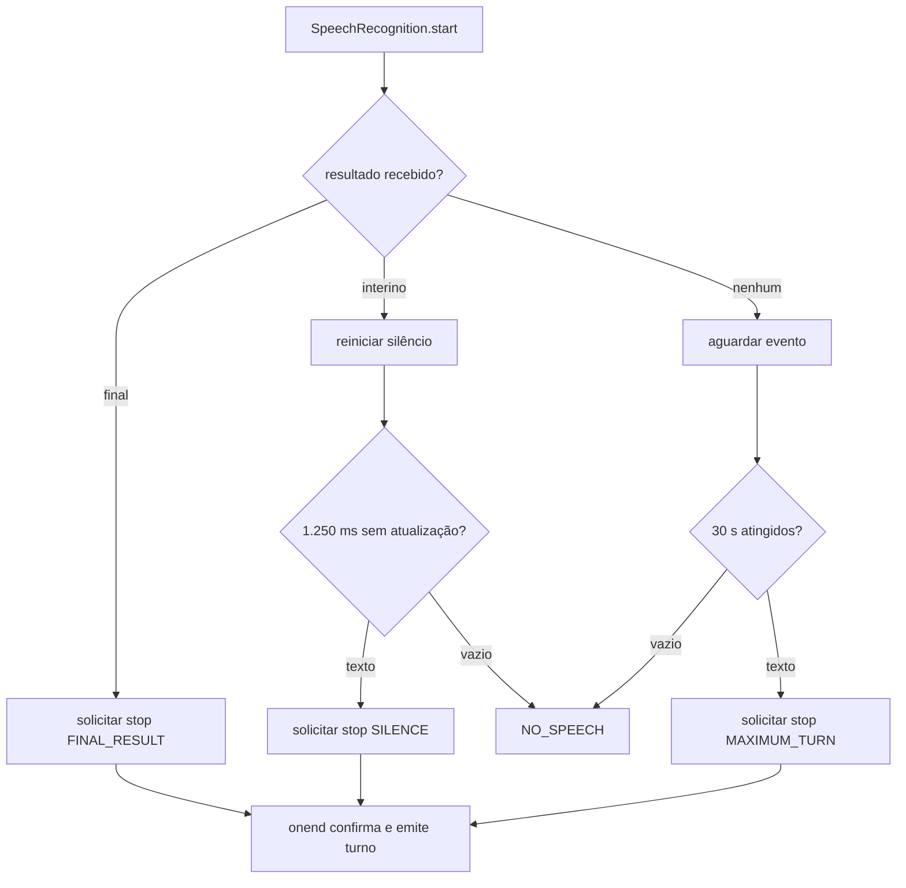

# VAL Turn Detection v1

Versão associada: `val.realtime_conversation.v1`.

Status: algoritmo browser-native implementado e coberto por testes determinísticos. A calibração acústica em dispositivos físicos permanece pendente.

## Finalidade

Turn Detection decide quando uma captura finita contém fala suficiente para formar uma mensagem da conversa. Ele recebe eventos da Web Speech API, mantém somente um transcript normalizado por captura e emite no máximo um turno.

Não existe VAD próprio, análise de waveform, streaming de áudio ao backend, diarização, wake word ou modelo de turn-taking. Silêncio e resultado final são sinais fornecidos ou inferidos em torno de `SpeechRecognition` no navegador.

Implementação canônica: `createWebSpeechInputProvider()` em `src/lib/realtime-conversation.js`.

## Configuração atual

| Parâmetro | Padrão | Limite aplicado | Uso |
|---|---:|---:|---|
| idioma | `pt-BR` | sem fallback automático no provider | idioma pedido ao navegador |
| `continuous` | `false` | fixo | uma sessão de reconhecimento por turno |
| `interimResults` | `true` | fixo | permite feedback e conclusão por silêncio |
| `maxAlternatives` | `1` | fixo | usa uma hipótese por resultado |
| `silenceMs` | 1.250 ms | mínimo 400 ms | encerra transcript parcial após inatividade |
| `maximumTurnMs` | 30.000 ms | mínimo 5.000 ms | impede captura indefinida |
| transcript | até 4.000 caracteres | fixo | normalização e limite antes da emissão |

Os timers são injetáveis para teste. Os padrões usam `setTimeout` e `clearTimeout` do ambiente.

## Normalização

Antes de exibir ou emitir um turno, `normalizeRealtimeTranscript()`:

1. converte o valor para string;
2. troca caracteres de controle por espaço;
3. colapsa espaços consecutivos;
4. remove espaços nas extremidades;
5. limita o resultado a 4.000 caracteres.

Resultado vazio depois da normalização não é emitido como turno.

## Algoritmo

1. `start()` recusa nova abertura se o provider estiver descartado, sem suporte ou já ativo.
2. Uma nova instância de `SpeechRecognition` é criada e configurada.
3. `onstart` informa `INPUT_STARTED`; somente então o indicador pode declarar o microfone ativo.
4. Em `onresult`, o provider percorre os resultados entregues pelo navegador, separa partes finais e interinas, normaliza a concatenação e atualiza a transcrição em andamento.
5. Se houver qualquer parte final, o provider solicita `stop()` com razão `FINAL_RESULT`.
6. Se houver apenas transcript interino, reinicia o timer de silêncio.
7. Ao vencer o silêncio, solicita encerramento com razão `SILENCE`; se não houver texto, usa `NO_SPEECH`.
8. Ao vencer o limite máximo, solicita encerramento com razão `MAXIMUM_TURN`; se não houver texto, usa `NO_SPEECH`.
9. Somente `onend` marca a captura inativa e emite o transcript utilizável com a razão de encerramento. Sem texto, chama `onNoTurn`.
10. A flag interna `emitted` impede emissão duplicada mesmo quando `onresult`, timer e `onend` ocorrem próximos.



O timer máximo corre desde a tentativa de início da sessão. O timer de silêncio só é armado depois de transcript não vazio.

## Matriz de decisão

| Sinal | Transcript normalizado | Razão do turno | Ação |
|---|---|---|---|
| resultado com parte final | não vazio | `FINAL_RESULT` | solicita `stop()`; emite uma vez após `onend` |
| timer de silêncio | não vazio | `SILENCE` | solicita `stop()`; emite uma vez após `onend` |
| timer máximo | não vazio | `MAXIMUM_TURN` | solicita `stop()`; emite uma vez após `onend` |
| encerramento do navegador | não vazio | `stopReason` ou `BROWSER_END` | marca captura inativa e emite uma vez |
| silêncio, limite ou encerramento | vazio | nenhuma | `onNoTurn` |
| erro “no-speech” ou não mapeado | — | nenhuma | `onNoTurn` como `SPEECH_NOT_UNDERSTOOD` |
| erro material | — | nenhuma | encerra a captura e chama `onError` |

## Erros normalizados

| Erro do navegador | Código da VAL | Comportamento |
|---|---|---|
| `not-allowed`, `service-not-allowed` | `MICROPHONE_PERMISSION_DENIED` | erro explícito e fallback |
| `audio-capture` | `MICROPHONE_UNAVAILABLE` | erro explícito e fallback |
| `network` | `SPEECH_SERVICE_UNAVAILABLE` | orienta voz sob demanda ou texto |
| `language-not-supported` | `LANGUAGE_UNAVAILABLE` | informa indisponibilidade de português |
| demais códigos, inclusive `no-speech` | `SPEECH_NOT_UNDERSTOOD` | não cria turno; permite nova tentativa |
| exceção ao construir/iniciar | `RECOGNITION_START_FAILED` | não mantém captura ativa |

O provider não inclui transcript no objeto de erro.

## Relação com o FSM

Quando há turno:

```text
LISTENING -> TURN_DETECTED -> PROCESSING
```

O provider só produz `TURN_DETECTED` depois de `onend` marcar a captura inativa. Assim o indicador não declara o microfone desligado enquanto o navegador ainda reporta reconhecimento ativo. Durante `PROCESSING` e `SPEAKING`, o reconhecimento não fica ativo. Depois de `SPEECH_ENDED`, o FSM volta a `LISTENING` e o hook agenda outra instância de reconhecimento após 200 ms.

Quando não há turno, o FSM usa `INPUT_ENDED` e entra em `PAUSED` com a razão recebida. Erros materiais levam a `ERROR`; ausência de suporte leva a `FALLBACK`.

## Pausa, aborto e descarte

| Operação | Ação no provider | Possível emissão |
|---|---|---|
| pausa durante escuta | `stop({emitPartial:false, reason:'USER_PAUSE'})` | limpa o parcial e entra em `PAUSED` somente após `onend`; não emite turno |
| barge-in | `abort({reason:'BARGE_IN'})` | não emite novo turno do provider abortado |
| sair | `abort({reason:'EXIT'})` | não emite novo turno |
| desmontar hook | `dispose()` | aborta, limpa timers e impede uso posterior |

Portanto, “pausar” descarta o parcial do turno corrente. Saída e interrupção usam `abort()` para cancelamento imediato do provider.

## Privacidade

O detector não grava arquivo de áudio, não envia bytes de áudio a uma rota da VAL e não persiste waveform. Ele recebe somente eventos e transcripts oferecidos pela Web Speech API.

Isso não garante processamento local: `SpeechRecognition` pode enviar áudio ou dados ao serviço do navegador conforme fornecedor, plataforma e configuração. Essa operação está fora do controle do backend da VAL e precisa ser validada na política do ambiente antes de uso com dados reais.

O transcript emitido entra no fluxo autenticado de chat como conteúdo do usuário. A política `persistence: NONE` impede promoção automática a memória confirmada, mas não elimina o processamento normal da mensagem na conversa.

## Observabilidade do limite de turno

O provider marca o último evento de reconhecimento como aproximação de `speechEnd` e o instante da emissão pós-`onend` como `transcript`. O hook marca `reasoning` separadamente ao entrar em `onTranscript` e publica esses marcos somente na fonte `BROWSER_VOICE_TURN`, contrato `val.conversation_latency.browser_voice_turn.v1`. Assim:

- `speech_end_to_transcript` mede o intervalo observável do navegador, não o fim acústico por VAD;
- `transcript_to_first_reasoning` mede o handoff local, não transporte ou entrada efetiva no backend;
- a razão de encerramento (`FINAL_RESULT`, `SILENCE` ou `MAXIMUM_TURN`) não é incluída no payload de métricas.

Essas métricas são úteis para integrar o restante do turno, mas não validam a qualidade ou latência do detector em hardware real.

## Evidência automatizada

Os testes atuais verificam:

- emissão única por resultado final;
- configuração `pt-BR` e `continuous=false`;
- conclusão de transcript interino por silêncio;
- cancelamento por `dispose()` sem turno adicional;
- nova instância a cada rearm;
- transições do FSM antes e depois do turno.

Os testes não usam áudio real e não medem ruído, sotaque, eco do alto-falante, Bluetooth, distância, Safari/PWA, Chrome/PWA ou latência do serviço de reconhecimento.

## Critérios ainda necessários para aprovação física

- resultado final e silêncio em iPhone real;
- resultado final e silêncio em Android real;
- permissão negada, revogada e retomada;
- pausa e saída com transcript parcial;
- eco durante TTS e barge-in explícito;
- captura por microfone interno e, quando aplicável, Bluetooth;
- comportamento em Safari/Chrome e PWA instalada;
- amostra suficiente para calibrar `silenceMs` sem cortar frases nem aumentar espera percebida.

Até essas provas, os valores de 1.250 ms e 30.000 ms são parâmetros implementados, não SLOs de dispositivo.
