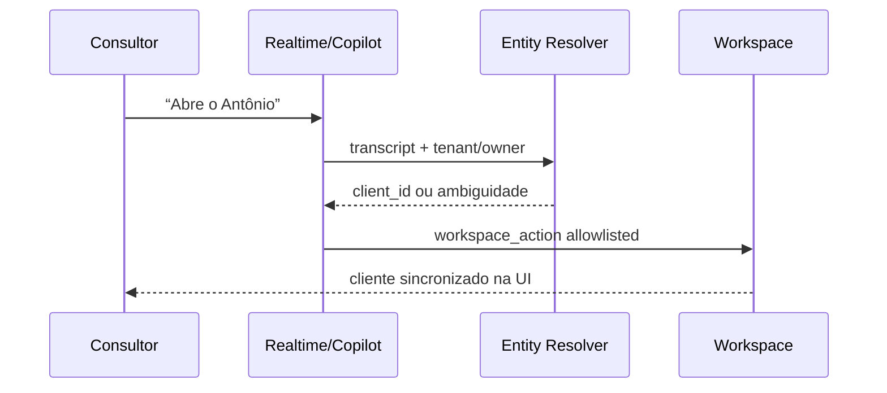

# VAL Voice Entity Search v1

## Fluxo

O fluxo não carrega contexto profundo antes de saber quem é o produtor. Após resolução única, o servidor dispara preload de contexto em background para a próxima pergunta.

## Realtime

`val_governed_tool` ganhou o reason `WORKSPACE`. O modelo Realtime deve enviar o pedido operacional completo. Se o backend devolver homônimos, a ferramenta devolve somente as opções autorizadas; a VAL pede a escolha e repete o comando com o nome selecionado.

## Performance local do componente

Com 500 clientes sintéticos e 2.000 amostras em Node, em 2026-08-29:

| Operação | P50 | P90 | P95 |
|---|---:|---:|---:|
| OPEN_CLIENT exact + route | 1,125 ms | 1,670 ms | 2,046 ms |
| SEARCH_CLIENT fuzzy | 2,580 ms | 4,224 ms | 6,199 ms |
| NAVIGATE_AGRONOMY | 0,006 ms | 0,006 ms | 0,007 ms |
| PREPARE_VISIT route | 0,005 ms | 0,005 ms | 0,005 ms |
| FOLLOW_UP_RESUME | 0,001 ms | 0,002 ms | 0,002 ms |

Escopo: `LOCAL_COMPONENT_ONLY`. Esses números não incluem rede, PostgreSQL, WebRTC, provider, áudio ou renderização física e não substituem UAT de latência percebida.
