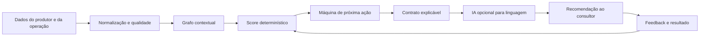

# VAL Conversion Core — decisão comercial determinística

## Objetivo

A VAL passa a operar como uma inteligência de decisão comercial para o agro. O modelo generativo continua disponível para explicar, resumir e adaptar linguagem, mas deixa de ser a fonte de prioridade, score, confiança, lacunas e próxima ação.

Regra de autoridade:

> dados e regras calculam; a IA explica; o consultor decide; o resultado ensina.

Quando a OpenAI estiver indisponível, a recomendação comercial continua funcionando. Quando estiver disponível, nenhum texto gerado pode substituir os campos calculados pelo Conversion Core.

## As sete barreiras transformadas em software

### 1. Grafo Comercial Agronômico

O núcleo consolida produtor, região, área, culturas, propriedades, oportunidades, visitas, interações, histórico, sinais e feedback. A saída `graph` contém nós, relações e contagem das fontes usadas. O objetivo não é somente armazenar registros, mas compreender como eles se conectam na decisão.

### 2. Qualidade e proveniência dos dados

Antes de recomendar, o núcleo mede identificação, município, área, culturas, compras, potencial, oportunidades, interações, critérios de decisão e datas. Também detecta contradições, como compras superiores ao potencial ou oportunidades fechadas com ação futura.

Nenhuma lacuna é preenchida por inferência generativa. Valor desconhecido permanece `null`; probabilidade desconhecida permanece `null`.

### 3. VAL Conversion Score

Cada oportunidade recebe score operacional de 0 a 100 por componentes verificáveis:

| Componente | Peso-base |
|---|---:|
| Valor econômico registrado | 25 |
| Urgência e janela | 20 |
| Prontidão da etapa | 15 |
| Evidências e completude | 15 |
| Momento do relacionamento | 10 |
| Aderência estratégica | 5 |
| Qualidade da conta | 10 |

O score ordena trabalho. Ele não é previsão de compra. O sistema mostra componentes, pesos, motivos, penalidades e campos ausentes.

### 4. Próxima Melhor Ação por máquina de estados

A próxima ação é escolhida por regras e contexto, não por improvisação do modelo. Os estados iniciais são:

- completar contexto mínimo;
- organizar validação técnica;
- sair da zona de preço;
- retomar compromisso vencido;
- converter intenção em compromisso;
- transformar proposta em caso de valor;
- quantificar necessidade;
- definir a próxima decisão.

Cada estado possui ação, pergunta aberta, pergunta fechada, critério de sucesso, prazo e comportamento a evitar.

### 5. Resposta explicável e não genérica

Toda resposta operacional contém:

- fatos e evidências;
- inferências identificadas;
- oportunidade selecionada;
- score e componentes;
- lacunas e contradições;
- confiança operacional;
- próxima ação e pergunta;
- critério que prova avanço.

A reconciliação final substitui respostas genéricas como “converse com o cliente” por orientação que cita o produtor, a oportunidade, o estágio, o motivo da prioridade e o compromisso esperado.

### 6. Aprendizado controlado por resultado

Aceite, edição, execução, ganho e perda alimentam uma camada de feedback. Os pesos só mudam após amostra mínima e dentro de limites conservadores. Não existe autoalteração silenciosa de prompt nem uso de texto gerado como verdade.

Ajustes iniciais permitidos:

- evidência: no máximo ±4 pontos de peso;
- urgência: no máximo ±3;
- momento do relacionamento: no máximo ±3.

Toda recomendação recebe assinatura de decisão e impressão digital do contexto para auditoria e comparação.

### 7. Arquitetura híbrida e segura

O Conversion Core é executado mesmo sem IA generativa. A camada generativa fica restrita a resumo e linguagem. Recomendações técnicas de produto, dose, mistura, aplicação ou diagnóstico permanecem bloqueadas para revisão habilitada.

Comparação comercial de produtos não é confundida com prescrição: a VAL pode organizar preço, custo, margem, escopo e prova, mas não afirmar equivalência ou superioridade técnica sem validação.

## Fluxo operacional

## Contrato de saída

Os campos de autoridade são:

- `conversion_intelligence.selected_opportunity`;
- `conversion_intelligence.score`;
- `conversion_intelligence.workflow`;
- `conversion_intelligence.data_quality`;
- `confidence`;
- `evidence_used`;
- `executive_brief`;
- `next_best_action`;
- `next_question`.

A interface existente consome os mesmos campos principais da VAL. Isso permite introduzir o novo núcleo sem apagar dados, sem trocar o banco e sem quebrar o modo demonstrativo.

## Critérios de aceite

1. Funciona com `OPENAI_API_KEY` ausente.
2. Não inventa valor, probabilidade ou evidência.
3. Negócios fechados e perdidos não aparecem no radar ativo.
4. Prazo vencido gera retomada, não continuidade automática.
5. Contradições reduzem a confiança e ficam visíveis.
6. Comparação de produto por preço/custo não vira prescrição.
7. Pedido de produto, dose ou aplicação exige revisão técnica.
8. O mesmo contexto, mensagem e relógio geram a mesma assinatura.
9. Resposta genérica é substituída por orientação contextual.
10. Feedback só altera pesos depois da amostra mínima.
