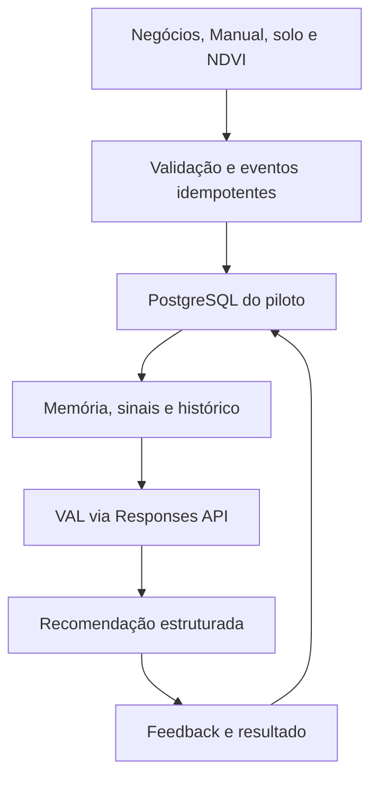

# Engine da VAL — arquitetura operacional

## O que “aprender” significa

A VAL não modifica silenciosamente o próprio prompt nem usa uma resposta gerada como verdade. O ciclo é:

1. fatos e documentos entram com fonte, data e idempotência;
2. a engine deriva hipóteses e sinais rastreáveis; eventos técnicos só viram sinal acionável quando carregam a aprovação exigida;
3. a IA propõe perguntas, valor e próxima ação;
4. o consultor aceita, edita ou rejeita;
5. execução, ganho, perda, margem e resultado agronômico voltam como eventos;
6. métricas e um ranker futuro aprendem offline, com versão e avaliação;
7. uma versão candidata só substitui a atual após revisão, shadow mode e possibilidade de rollback.

Regra: **o modelo raciocina; o banco memoriza; eventos alimentam avaliação controlada; humanos aprovam**.

## Componentes já preparados



- `server/val-engine.js`: roteamento OpenAI e fallback demonstrativo.
- `server/sales-playbook.js`: método, proteção comportamental e contrato JSON.
- `server/repository.js`: persistência PostgreSQL; fallback JSON existe apenas no modo demonstrativo sem banco.
- `server/ingestion.js`: eventos do Manual e sinais auditáveis.
- `database/schema.sql`: banco canônico com organizações, ainda operado como tenant único.
- `knowledge/approved/`: única pasta que pode ser enviada à base semântica.
- `test/`: testes de roteamento, HMAC, NDVI, solo e limites éticos.

## Estratégia de modelos

| Camada | Modelo padrão | Uso |
|---|---|---|
| Uso diário | `gpt-5.6-terra` | conversa, visita, objeção e próxima melhor ação |
| Estratégica | `gpt-5.6-sol` | grande conta, comitê, cenário ambíguo e proposta complexa |
| Alto volume | `gpt-5.6-luna` | classificação, normalização e extração após avaliação |

O roteador pode ser alterado por variáveis, sem modificar o frontend. A qualidade deve ser medida primeiro com o modelo mais forte e só depois comparada a opções menores.

Em agosto de 2026, a documentação oficial informa que a plataforma de fine-tuning está sendo encerrada para novos usuários. Por isso, o produto não depende de “auto-treino” da OpenAI. O aprendizado fica em memória, RAG privado, features, resultados, prompts versionados e um ranker auditável. O dataset permanece independente de fornecedor.

A Evals API também está em descontinuação: somente leitura em 31/10/2026 e encerramento previsto para 30/11/2026. Os casos dourados e resultados da VAL ficam no próprio repositório/banco e no CI.

## OpenAI e privacidade

A chave existe apenas no backend. Nunca criar `VITE_OPENAI_API_KEY`, nunca salvar em GitHub, navegador, arquivo de frontend ou chat. Uma chave cadastrada não ativa a IA enquanto PostgreSQL e autenticação do piloto não estiverem saudáveis.

As chamadas usam Responses API, Structured Outputs e `store:false` por padrão. A memória de cliente fica no PostgreSQL do VALOR 360. Materiais privados de clientes não devem ir para o File Search hospedado; a variável de vector store é reservada a playbooks aprovados e não sensíveis.

Documentação oficial:

- Modelos: https://developers.openai.com/api/docs/models
- Seleção: https://developers.openai.com/api/docs/guides/model-selection
- Responses: https://developers.openai.com/api/docs/guides/migrate-to-responses
- Structured Outputs: https://developers.openai.com/api/docs/guides/structured-outputs
- File Search: https://developers.openai.com/api/docs/guides/tools-file-search
- Controles de dados: https://developers.openai.com/api/docs/guides/your-data
- Segurança de chave: https://developers.openai.com/api/docs/guides/production-best-practices
- Otimização e fine-tuning: https://developers.openai.com/api/docs/guides/model-optimization
- Boas práticas de avaliação: https://developers.openai.com/api/docs/guides/evaluation-best-practices

## Variáveis privadas

Configure nesta ordem para IA real:

```text
DATABASE_URL
VAL_ADMIN_EMAIL
VAL_ADMIN_PASSWORD=<mínimo 12 caracteres>
VAL_SESSION_SECRET=<aleatório, mínimo 32 caracteres>
VAL_MANUAL_WEBHOOK_SECRET=<segredo longo e aleatório>
OPENAI_API_KEY=<adicionar por último>
```

Recomendadas:

```text
OPENAI_STORE_RESPONSES=false
VAL_MODEL_DAILY=gpt-5.6-terra
VAL_MODEL_STRATEGIC=gpt-5.6-sol
VAL_MODEL_FAST=gpt-5.6-luna
OPENAI_TIMEOUT_MS=60000
OPENAI_MAX_RETRIES=1
VAL_MAX_OUTPUT_TOKENS=26000
VAL_STRATEGIC_MAX_OUTPUT_TOKENS=32000
```

O pre-deploy roda `npm run db:migrate`. Sem `DATABASE_URL`, ele falha fora do modo demonstrativo. JSON só é permitido quando `VAL_DEMO_MODE=true` foi ativado explicitamente; a IA real permanece bloqueada.

Antes da primeira migração de um banco 0.3, restaure uma cópia em staging e valide a contagem de usuários, clientes, perfis, visitas, oportunidades, recomendações e contexto técnico. A migração usa lock e marcador de versão para não ressuscitar registros antigos, mas não oferece compatibilidade de rollback para um binário anterior; faça snapshot e janela controlada de deploy.

## Contrato com o Manual do Agrônomo

Endpoint:

```text
POST /api/v1/integrations/manual/events
X-Valor-Signature: sha256=<HMAC do corpo bruto>
```

Eventos aceitos:

- `business.closed`
- `business.lost`
- `business.updated`
- `field_report.completed`
- `soil_analysis.completed`
- `ndvi.observation`

Envelope:

```json
{
  "externalId": "manual-evento-123",
  "type": "ndvi.observation",
  "occurredAt": "2026-08-08T12:00:00-03:00",
  "source": "manual-do-agronomo",
  "clientExternalKey": "produtor-123",
  "propertyExternalKey": "fazenda-1",
  "fieldExternalKey": "talhao-14",
  "payload": {
    "index": "NDVI",
    "anomaly": true,
    "changePercent": -14,
    "mapId": "mapa-456"
  }
}
```

A mesma combinação `source + externalId` nunca é processada duas vezes. Uma anomalia NDVI cria vistoria, não diagnóstico. Solo só gera sinal comercial com `validatedFlags` fornecidas pelo fluxo técnico revisado.

Relatório de campo e solo precisam trazer também prova de aprovação para gerar sinal:

```json
{
  "validation": {
    "status": "approved",
    "reviewerExternalId": "agronomo-123",
    "reviewedAt": "2026-08-08T15:00:00-03:00"
  }
}
```

A assinatura HMAC comprova qual sistema enviou o evento; esse objeto registra a atestação de revisão feita pelo Manual. A VAL valida identidade informada e data, mas não possui uma assinatura individual independente do agrônomo. Sem HMAC e uma atestação válida, o dado bruto é preservado, mas nenhuma ação é tratada como validada.

## Estado assíncrono compartilhado no frontend

`src/hooks/useAsyncResource.js` é a fonte única para o contrato `{loading, data, error}` das leituras principais. O hook cancela a solicitação anterior, impede que uma resposta atrasada substitua dados mais novos, aplica o orçamento de tempo definido pela tela e normaliza timeout, cancelamento e falha real. A leitura de JSON e o tratamento de sessão expirada também ficam centralizados.

As telas `ValPanel`, `ValDecisionWorkspace`, `SogWorkspace`, `AccessManagement` e `ProducerBusinessOverview` usam esse contrato. Estados de mutação, como salvar formulário, alterar acesso ou enviar feedback, continuam separados porque representam uma ação diferente do carregamento da página.

Cada recurso mantém sua própria mensagem e seu próprio orçamento de tempo, mas usa a mesma mecânica de cancelamento e erro. O timeout precisa ser definido ao declarar o recurso, e não diretamente em chamadas `fetch` dispersas pelo componente.

## API da VAL

### Status

`GET /api/val/status`

Informa se OpenAI, PostgreSQL, webhook e base de conhecimento estão ativos, sem revelar nenhum segredo.

### Recomendar

`POST /api/val/chat`

#### Orçamento de tempo do cliente

As duas interfaces que chamam este endpoint (`ValPanel.jsx` e `ValDecisionWorkspace.jsx`) usam o mesmo timeout de **120 segundos**. Esse orçamento é deliberadamente maior que o pior caso permitido para o provedor no servidor:

| Etapa | Orçamento máximo |
|---|---:|
| chamada ao provedor no backend | 100 s |
| reconciliação, anexos e persistência | 15 s |
| transporte e entrega ao navegador | 5 s |
| **timeout total do cliente** | **120 s** |

O timeout do navegador não deve ser reduzido isoladamente em uma das telas. Se o limite do servidor mudar, atualize as duas interfaces, esta tabela e `test/val-chat-timeout-budget.test.js` na mesma PR. Cancelamentos manuais por troca de produtor, navegação ou nova pergunta continuam usando `AbortController` e não aguardam o orçamento completo.

```json
{
  "clientId": "produtor-123",
  "client": {},
  "message": "Prepare uma visita para explorar a queda de vigor",
  "mode": "daily"
}
```

A saída inclui resposta interna, objetivo, dimensões decisórias observáveis, próxima pergunta, plano opcional, tensão aplicável, não aplicável ou bloqueada, comparação entre agir, esperar e manter, próxima ação, compromisso opcional, confiança categórica, evidências estruturadas, revisão humana e ações bloqueadas.

Se a solicitação ou saída contiver diagnóstico, produto, dose, mistura, taxa de aplicação ou sinal agronômico pendente, a engine descarta o conteúdo técnico acionável, persiste a recomendação como `pending_review` e devolve somente um pacote seguro de encaminhamento. O piloto ainda não possui endpoint para liberar esse conteúdo: a validação volta pelo evento assinado do Manual; uma esteira corporativa de aprovar/rejeitar continua obrigatória antes de uso amplo.

### Progresso de uma análise

`GET /api/val/progress?requestId=<uuid>`

As telas geram um UUID por chamada e consultam esta rota somente enquanto a análise está ativa. O registro é temporário, fica em memória, expira em cinco minutos e é isolado pelo usuário autenticado. A rota nunca expõe mensagem, produto, preço, dado do produtor ou conteúdo do modelo; devolve apenas a etapa operacional.

No modo estratégico, a interface apresenta a sequência real: **Cruzando histórico e sinais** → **Comparando alternativas de produto** → **Redigindo a recomendação** → **Salvando a recomendação**. Saltos são permitidos quando a IA não é necessária; regressões de etapa são bloqueadas.

### Feedback

`POST /api/val/feedback`

Registra nota, aceite/edição/rejeição, execução, ganho/perda e observação. O resultado só ensina quando a recomendação foi realmente exibida e a ação registrada.

## Próximas camadas antes de uma operação empresarial

1. identidade corporativa, organizações, papéis e tenant dentro da sessão (a versão atual tem somente autenticação mínima de um administrador);
2. Row-Level Security aplicada e testada entre tenants;
3. object storage, antivírus, OCR e quarentena de arquivos;
4. PostGIS para geometrias e raster/COG em bucket;
5. busca privada híbrida e embeddings dentro da infraestrutura do produto;
6. ferramentas da VAL inicialmente somente leitura;
7. escrita apenas em rascunho e com confirmação humana;
8. dataset de avaliação próprio no CI, com casos de prompt injection, vazamento, alucinação, ROI e abstenção.

Arquivos PDF/Excel de campo e rasters ainda não entram diretamente nessa esteira. Hoje, o Manual precisa enviar eventos JSON estruturados; object storage, antivírus, OCR, parser, COG/PostGIS e quarentena continuam pendentes.

O schema já separa organizações, mas a versão 0.4 é deliberadamente um piloto de tenant único. Não declarar suporte multiempresa antes de RLS e testes de isolamento.

## Limites legais e técnicos

- Os cinco perfis são tags legadas do Produtor 360, não diagnóstico psicológico nem base suficiente para adaptar uma abordagem.
- Inferências precisam de fonte, confiança, validade e possibilidade de correção.
- Decisão automatizada relevante deve permitir explicação e revisão humana.
- A VAL não concede preço, crédito ou condição diferenciada com base em perfil psicológico.
- NDVI é triagem.
- Dose, mistura, produto, receita ou recomendação regulada exige profissional habilitado, fonte oficial e rastreabilidade.
