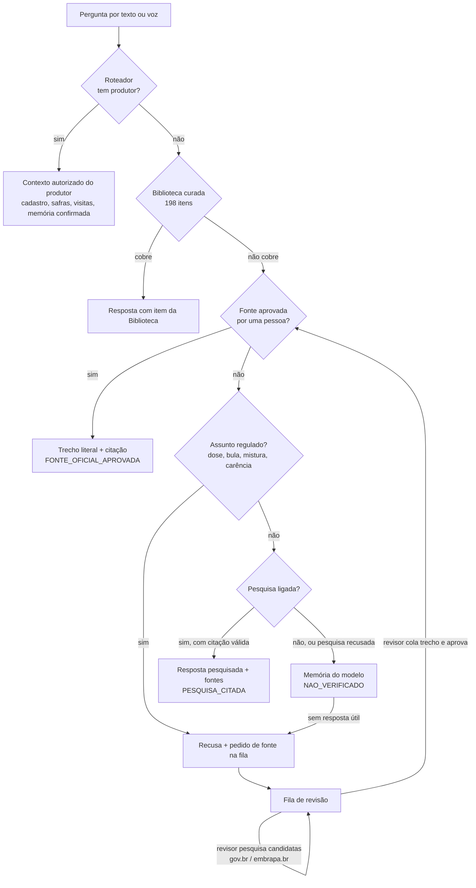

# VAL: pergunta sobre o produtor e dúvida técnica com pesquisa — 22 de setembro de 2026

Desenho do sistema pedido: o consultor pergunta, por texto ou em conversa por voz em tempo real, tanto sobre um produtor da carteira quanto sobre uma dúvida técnica que foge dos dados cadastrados. A VAL decide o caminho, responde com a origem visível e, quando não sabe, não inventa.

## Uma premissa corrigida

Chamar a OpenAI não é pesquisar. O caminho de dúvida geral que existia (`generateGeneralModelAnswer`) pede ao modelo que responda **de memória**: sem fonte, sem data, e por isso a resposta sai marcada como `UNVERIFIED_MODEL_KNOWLEDGE`. Pesquisa é a ferramenta `web_search` da própria API da OpenAI — a mesma conta e o mesmo cliente que a VAL já usa — que busca na hora, restrita por domínio, e devolve o endereço de cada trecho usado. Não há provedor novo a contratar; o registro de governança que dizia o contrário foi corrigido.

## Voz e texto usam o mesmo caminho

A conversa por voz em tempo real não tem cérebro próprio. O modelo de voz chama uma única ferramenta, `val_governed_tool`, que o navegador encaminha para o mesmo `/api/val/chat` do texto (`GlobalValCopilot.jsx`, `onRealtimeToolCall`). Tudo o que está abaixo vale igualmente para voz e para texto, sem código duplicado.

## O caminho de uma pergunta

## Os dois exemplos, ponta a ponta

**1. "Quantos hectares de soja o Genor Brum Filho plantou nesta safra?"** — o roteador encontra o produtor e a pergunta segue pelo contexto autorizado dele. Nada disto foi alterado nesta entrega: é o caminho que a VAL já fazia, com isolamento por tenant, consultor e produtor.

**2. "Como o plantio direto reduz a erosão do solo?"** — sem produtor, sem item na Biblioteca, sem fonte aprovada e sem ser assunto regulado. Com a pesquisa ligada, a VAL busca em `gov.br`, `embrapa.br` e universidades, e responde:

> O plantio direto mantém a palhada sobre o solo, o que protege contra o impacto da chuva e reduz a erosão.
> Fontes: Sistema plantio direto (www.embrapa.br).

A tela mostra que a resposta foi **pesquisada e citada, mas não revisada por ninguém**. Em voz, o texto já sai sem endereços embutidos, para não serem lidos em voz alta.

**2b. "Qual a dose de glifosato por hectare?"** — assunto regulado. A pesquisa automática **não responde isso**, com ou sem a flag. A VAL recusa, diz que registrou a dúvida, e a pergunta entra na fila. O revisor técnico toca em *Pesquisar fontes oficiais*, recebe endereços candidatos só de `gov.br`/`embrapa.br`, abre a fonte, cola o trecho literal e aprova em seu nome. A partir daí, a mesma pergunta — de qualquer consultor da organização — é respondida com o trecho e a citação, antes de qualquer chamada ao modelo.

## Estado por peça

| Peça | Implementação e evidência | Limitação / pendência |
|---|---|---|
| Pedido de fonte | Os becos sem saída de assunto regulado e falta de cobertura registram a dúvida; a mesma pergunta soma peso numa linha só. Provedor fora do ar e teto estourado não entram na fila. | Sem PostgreSQL a fila não existe e o comportamento volta ao anterior. |
| Fonte aprovada responde | Trecho literal + citação, com exceção nomeada no grounding (`APPROVED_OFFICIAL_SOURCE`). Afirmação sobre produtor nomeado segue barrada. | A vigência depende de o revisor preencher `valid_until`. |
| Pesquisa citada | `web_search` com `allowed_domains`, conferência de cada citação contra a lista, descarte da resposta inteira se uma citação sair da lista, portão contra dose/mistura/marca. **Sem atalho de relevância**: passa pelo mesmo crivo da resposta de memória. | Desligada por padrão. Não foi executada contra a OpenAI real nesta entrega: o ambiente de desenvolvimento não alcança `api.openai.com`. Testes usam o formato de resposta do SDK instalado. |
| Candidatas para o revisor | Disparadas pelo revisor, não pelo consultor: sem latência na conversa e custo só quando alguém vai usar. Gravam endereço e título — nenhum texto escrito pelo modelo. | Tela ainda não conferida em navegador autenticado. |
| Custo | A pesquisa entra no teto de IA geral que já existia (US$ 5 por consultor por login). Quando ele estoura, o cliente de IA vira `null` e a pesquisa para junto. | A taxa por busca é estimativa conservadora (US$ 0,03), a ajustar pelo preço vigente em `VAL_WEB_RESEARCH_CALL_COST_USD`. |
| Revisão | Restrita a `admin` e `technical_reviewer`. O revisor técnico vê a revisão de fontes e continua sem ver Administração. | — |

## Como ligar

| Variável | Padrão | Efeito |
|---|---|---|
| `VAL_WEB_RESEARCH_ENABLED` | `false` | Liga a pesquisa citada no copiloto e o botão de candidatas na revisão. |
| `VAL_WEB_RESEARCH_DOMAINS` | `gov.br,embrapa.br,usp.br,unesp.br,unicamp.br,ufv.br,ufla.br,ufrgs.br,ufpr.br` | Domínios permitidos para dúvida conceitual. Candidatas de bula usam só `gov.br` e `embrapa.br`, independente desta lista. |
| `VAL_WEB_RESEARCH_CALL_COST_USD` | `0.03` | Estimativa por busca que alimenta o teto por consultor. |

As migrações `20260922_015` e `20260922_016` rodam no `preDeployCommand` existente.

## A falha intermitente da voz

A conversa por voz voltou a funcionar sem nenhuma correção de voz publicada: o reimplante de 22/09 às 22:28 UTC (`8fe254be`) foi sobre contexto de perfil. Isso é coerente com o diagnóstico feito nos logs do staging: a cada tentativa com falha, a sessão paga era criada (HTTP 201) e encerrada cerca de 800 ms depois, sem turno. O microfone já tinha sido concedido nesse ponto — `getUserMedia` roda antes de qualquer chamada paga. O que falhava era a troca de SDP entre o navegador e `api.openai.com`, a única chamada cross-origin do fluxo, que o navegador rejeitava com um `TypeError` sem status.

Uma falha que vai e volta nessa chamada aponta para o caminho de rede entre o navegador e a OpenAI, ou para indisponibilidade momentânea do provedor — não para o microfone nem para o servidor da VAL, cujas chamadas funcionavam normalmente no mesmo minuto. A causa exata não pôde ser nomeada porque o navegador não entrega status nem corpo nesse tipo de falha, e o servidor descartava o motivo que o navegador enviava. O commit `6c6db90` passa a gravar no log da sessão o passo, o status e o detalhe do erro. **Depois que essa branch estiver no staging, a próxima falha vai aparecer nomeada no log**, e aí dá para dizer se é rede, provedor recusando (status 4xx/5xx) ou outra coisa.

## Verificação

- Suíte completa: ver o commit desta entrega; zero falhas, um skip pré-existente (`ffprobe` ausente no ambiente).
- Persistência de pedidos e candidatas: PGlite com as migrações do projeto, incluindo as restrições de banco que recusam aprovação sem responsável e candidatas fora de lista.
- Pesquisa: respostas simuladas no formato do SDK `openai` instalado (`web_search_call`, `url_citation`), porque o ambiente de desenvolvimento não alcança a OpenAI. **Não é teste contra o provedor real.**
- Nada foi publicado. O staging segue em `integration/val-pr106-rodada14-20260920`.
