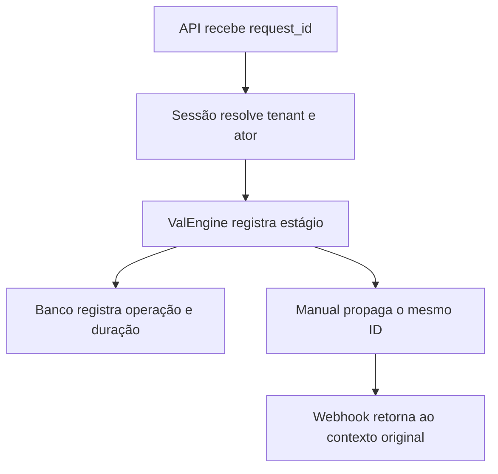

# Observabilidade e composição da engine

## Request/correlation ID

Toda requisição recebe UUID em `X-Request-Id`. Um UUID válido enviado em `x-request-id` ou `x-correlation-id` é preservado; qualquer outro valor é substituído. O contexto usa `AsyncLocalStorage`.

Eventos implementados:

- `api.received` e `api.completed`;
- `val.answer.started` e `val.answer.completed`;
- `db.query`, somente operação, duração, row count e código de erro;
- `integration.sent` e `integration.received`.

Não entram no log: SQL, parâmetros, cookies, tokens, prompts, anexos, e-mail, IDs brutos de ator/tenant ou payload de integração. Ator e tenant aparecem apenas como referências hash de 16 caracteres.

## Composição atual caracterizada

| Arquivo | Classe | Método instalado | Ordem |
|---|---|---|---:|
| `conversion-bootstrap.js` | `ValRepository` | `getClientContext` | 1 |
| `conversion-bootstrap.js` | `ValRepository` | `getIntelligence` | 2 |
| `conversion-bootstrap.js` | `ValRepository` | `recordRecommendation` | 3 |
| `conversion-bootstrap.js` | `ValEngine` | `answer` | 4 |
| `conversion-bootstrap.js` | `ValEngine` | `status` | 5 |
| `innovation-bootstrap.js` | `ValRepository` | `getClientContext` novamente | 6 |

Os arquivos não foram alterados. Testes runtime provam que os dois wrappers de contexto coexistem e que o fallback determinístico, a persistência e o status continuam iguais.

## Desenho futuro do VAL Core — não implementado

O Passo 02 poderá introduzir uma factory explícita sem mudar as APIs externas:

1. criar implementações base existentes de repository e engine;
2. aplicar decorators nomeados em array ordenado;
3. validar dependências e duplicidade de método no bootstrap;
4. expor a mesma interface usada por `server.js`;
5. retirar um patch de prototype por vez, protegido pelos testes atuais.

O contrato sugerido é `composeValCore({repository, engine, decorators, telemetry})`. A migração só avança quando a saída antes/depois for idêntica no golden set e no fallback. Nenhuma parte desse desenho foi ativada nesta fase.
