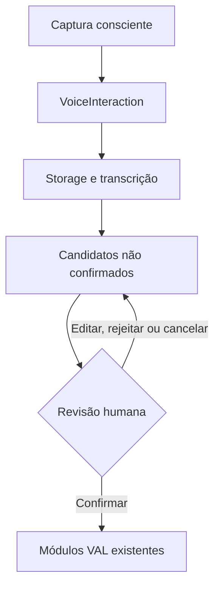

# ADR — Voice Capture como camada transversal da VAL

Status: implementado localmente na branch `feature/voice-capture`; validação final, staging e gate ainda pendentes.

Base auditada: `integration/val-v1-staging` em `b5967758428dc501d97407bb50d2cdb200c4ade7`, árvore `3ecc2252fec5ac3a4d410039812037fcc6e3b764`. A branch não parte de `main` e essa base contém a cadeia aprovada das Fases 02–06.

## Contexto auditado

Antes desta implementação já existiam:

- upload genérico de anexos em `val_attachments`, com bytes em `content_base64`, hash, tenant, consultor e produtor;
- interpretação de anexos pela VAL;
- o fluxo da Fase 6 para `VisitReport v1`, inclusive `source_type: AUDIO`, `transcript_ref`, confirmação, Commitment, Outcome e LearningCandidate;
- provider de transcrição injetável no Visit Loop;
- OpenAI configurada apenas no servidor;
- limites gerais de body e de anexos.

O caminho anterior era específico do relato de visita. Ele não oferecia um agregado transversal para pré-visita, nota de campo e Cliente 360, nem revisão própria, cancelamento/retry da captura e isolamento do armazenamento físico por uma porta de voz.

## Decisão

Implementar o **VCE — Voice Capture Engine** como camada de captura, não como novo cérebro cognitivo.

Fluxo efetivamente implementado:

`capturar/enviar → validar → armazenar → transcrever → extrair candidatos → revisar → confirmar → aplicar nos módulos existentes`.

Fronteiras implementadas:

1. `VoiceCapture` e `useVoiceRecorder` no frontend;
2. seis operações HTTP aditivas em `/api/v1/voice-interactions`;
3. transição explícita `POST /api/v1/visits/{visitId}/start`, que torna FIELD e POST alcançáveis pela jornada da UI;
4. `VoiceCaptureService` para o ciclo de vida;
5. `VoiceAudioStorage`/`RepositoryAttachmentVoiceStorage` para mídia;
6. `TranscriptionProvider` e adapters OpenAI, mock e indisponível;
7. `VoiceCandidateExtractor`, com Structured Outputs quando OpenAI está disponível e regras determinísticas seguras como fallback de extração;
8. `VoiceInteraction v1` e `VoiceCandidate v1` versionados;
9. confirmação humana fail-closed;
10. adaptadores para memória/contexto, preparação e o Visit Loop existente.

## Contextos e efeitos reais

| `interaction_type` | Vínculo de visita | Efeito permitido após confirmação |
|---|---|---|
| `PRE_VISIT` | obrigatório no service | memória/contexto confirmados e nova versão de PrepareVisit |
| `POST_VISIT` | obrigatório no service | VisitReport confirmado, Interaction/MMI, Commitment quando válido, oportunidade, Outcome e LearningCandidate |
| `FIELD_NOTE` | opcional | Interaction, memórias permitidas, Commitment/oportunidade apenas se explicitamente confirmados e válidos |
| `CLIENT_NOTE` | opcional | Interaction, memórias permitidas, Commitment/oportunidade apenas se explicitamente confirmados e válidos |
| `GENERAL_CONTEXT` | opcional | mesmos efeitos não pós-visita autorizados pela revisão |

Somente `POST_VISIT` passa pelo ciclo de Outcome e LearningCandidate. Nenhum tipo promove `KnowledgeItem` automaticamente.

## Persistência

A migration expand-only `20260823_005_voice_capture_expand.sql` adiciona:

- `val_voice_interactions`, com estado, referências, candidatos iniciais e revisados, metadata, artefatos relacionados, retry e revisão;
- `val_voice_transcripts`, com uma linha por tentativa, texto, provider/model/versão, status, idioma, duração, confidence e erro seguro;
- FKs e índices tenant-aware para organização, ator, produtor, visita, áudio e transcript.

O runtime também valida que produtor e visita pertencem à carteira do ator. A migration protege tenant e identidades relacionadas, mas a coerência visita–produtor da VoiceInteraction é validada pelo service/repository, não por uma FK composta específica entre esses dois campos.

## Armazenamento

O adapter inicial implementado é `RepositoryAttachmentVoiceStorage`:

- `store(input)` valida e cria um anexo exclusivo (`deduplicate: false`);
- `load(input)` revalida tenant, ator e produtor;
- `mark(input)` altera somente status e metadata em allowlist.

O áudio fica temporariamente em `val_attachments.content_base64`; `audio_ref` usa `attachment:<uuid>`. O limite é 6.000.000 bytes e 900 segundos. MIME, data URL, assinatura binária e duração medida por `ffprobe` são validados no servidor.

Object storage privado continua sendo a arquitetura-alvo. Nenhum bucket ou recurso pago foi criado.

## Transcrição e extração

Quando `OPENAI_API_KEY` existe, o servidor instancia o adapter OpenAI com o modelo de `VAL_VOICE_TRANSCRIPTION_MODEL` (padrão `gpt-transcribe`). Sem cliente configurado, o adapter indisponível falha explicitamente; o áudio permanece para retry e a UI oferece fallback textual.

A extração é uma etapa separada. Ela usa `VAL_VOICE_EXTRACTION_MODEL` quando há cliente OpenAI e, em ausência ou falha do modelo, aplica regras determinísticas. Essa degradação da extração não simula transcrição: áudio ainda precisa ser transcrito ou substituído por texto manual.

Transcript é conteúdo não confiável. O extractor o delimita como `input_text`, aplica schema fechado e filtra prompt injection, atributos vocais/sensíveis e prescrição agronômica. A validação é reaplicada nas edições e adições humanas antes de persistir efeitos.

## Confirmação

Nenhum candidato escreve domínio antes de `CONFIRMED`. O request de confirmação precisa decidir explicitamente todos os candidatos como `CONFIRMED` ou `REJECTED`; permite editar texto, informar prazo e adicionar itens.

Limites implementados:

- até 50 itens originais na revisão;
- até 20 adições;
- no máximo 50 itens no total.

Confirmações usam compare-and-set por estado/revisão no repositório. `POST_VISIT` reutiliza a transação do Visit Loop; os demais tipos usam a transação de confirmação da VoiceInteraction. Não existe `idempotency_key` público no contrato de criação ou confirmação desta versão.

## APIs aditivas

- `POST /api/v1/voice-interactions`;
- `POST /api/v1/voice-interactions/{voiceInteractionId}/audio`;
- `POST /api/v1/voice-interactions/{voiceInteractionId}/process`;
- `GET /api/v1/voice-interactions/{voiceInteractionId}`;
- `POST /api/v1/voice-interactions/{voiceInteractionId}/confirm`;
- `POST /api/v1/voice-interactions/{voiceInteractionId}/cancel`.

Tenant e ator são derivados da sessão. O OpenAPI está em `openapi/val-core-v1.yaml`.

## Resiliência

- falha de transcrição preserva áudio e tentativa, entra em `FAILED_TRANSCRIPTION` e permite retry;
- falha de extração preserva transcript e entra em `FAILED_EXTRACTION`;
- leases em `related_artifacts.processing_lease` impedem worker expirado de sobrescrever retry mais novo;
- cancelamento aborta processamento local quando possível e não aplica efeitos;
- o ID pendente, sem áudio/transcript/candidato, pode ser retomado pela UI via `localStorage` por até sete dias;
- texto manual percorre transcrição lógica, extração e confirmação, sem chamar storage/transcrição externa.

## Segurança, privacidade e safety

- captura somente por ação consciente;
- nenhuma gravação secreta ou contínua;
- nenhuma análise de tom, emoção, sotaque, gênero ou idade aparente;
- nenhuma prescrição agronômica automática;
- logs em allowlist sem áudio, transcript, prompt ou secret;
- acesso revalidado por tenant, ator e carteira;
- nenhuma promoção automática de conhecimento.

## Evidência e pendências

| Camada | Estado desta revisão |
|---|---|
| código, contratos, migration, OpenAPI e UI | implementados localmente |
| suíte local | `npm test` 600/600; Voice Capture 92/92; fases explícitas 164/164 |
| builds | Vite/PWA e Manual aprovados localmente |
| smokes HTTP locais | não executados por restrição de rede do sandbox; permanecem pendentes em CI/staging |
| `ffprobe` real | 10/10 no storage, incluindo WAV sintético; codecs reais do navegador em staging permanecem pendentes |
| PostgreSQL 16, migrations, drift, backup/restore | job CI e verificador configurados; execução remota final ainda não registrada |
| OpenAI real | adapter testado com cliente simulado; chamada real em staging pendente |
| navegador em staging | pendente |
| microfone em iOS/Android/PWA real | pendente |
| gate final | pendente de PG16/staging/mobile e de registro em `GATE_VOICE_CAPTURE_RESULTADO.md` |

## Consequências e reversibilidade

As rotas e a UI são aditivas. Um rollback da aplicação pode deixar as novas tabelas inertes, pois a migration não remove nem reescreve estruturas anteriores. A dívida explícita é manter bytes em PostgreSQL até existir object storage autorizado e validado.

O recurso não deve ser classificado como aprovado apenas pela existência do código: integração OpenAI em staging, PostgreSQL 16 executado, navegador e celular físico continuam sendo evidências obrigatórias do gate.
