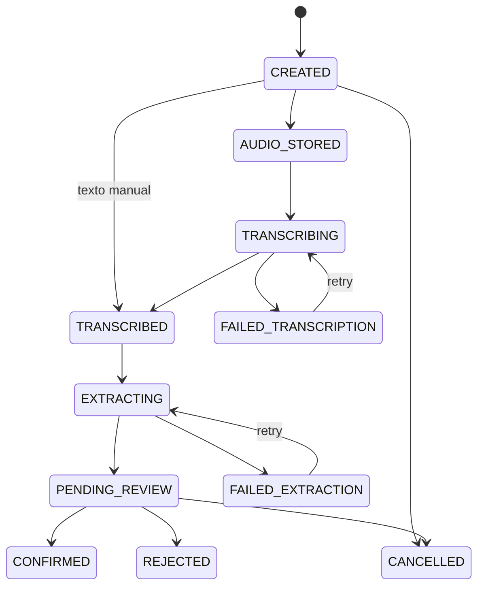

# VoiceInteraction v1

Versão: `val.voice_interaction.v1`.

Status: schema, runtime e persistência implementados e aprovados em CI/PostgreSQL 16; gate final reprovado pelas provas humana/mobile pendentes.

## Finalidade

`VoiceInteraction v1` governa uma captura consciente desde a criação até confirmação, rejeição ou cancelamento. Não é memória, perfil, recomendação ou conhecimento validado.

Separa:

1. áudio bruto temporário;
2. transcript falível e não confiável;
3. candidatos estruturados;
4. revisão humana;
5. efeitos downstream referenciados.

## Campos do contrato de runtime

| Campo | Tipo | Regra atual |
|---|---|---|
| `contract_version` / `version` | string | ambos `val.voice_interaction.v1` |
| `voice_interaction_id` | UUID | identidade estável |
| `organization_id` | string | tenant derivado da sessão |
| `actor_id` | string | ator derivado da sessão |
| `client_id` | string | produtor na carteira autorizada |
| `visit_id` | string/null | obrigatório para `PRE_VISIT` e `POST_VISIT` pelo service |
| `interaction_type` | enum | cinco tipos abaixo |
| `state` / `status` | enum | valores iguais; estado agregado |
| `audio_ref` | string/null | `attachment:<uuid>` no adapter atual |
| `transcript_ref` | string/null | `voice-transcript:<uuid>` |
| `transcript_status` | enum | tentativa ativa agregada |
| `duration_seconds` | number/null | `(0, 900]` quando áudio |
| `language` | string/null | até 30 caracteres |
| `confirmation_status` | enum | estado da revisão |
| `source_context` | object | contexto sanitizado; chaves de secret/áudio/transcript/prompt são descartadas |
| `transcription` | object | provider/model/version/status e metadata segura |
| `extraction` | object | metadata da extração, não o transcript |
| `candidates` | array | extração inicial, até 50 |
| `reviewed_candidates` | array | revisão final persistida, até 50 |
| `related_artifacts` | object | leases e IDs de preparação/report/outcome/learning |
| `retry_count` | integer | começa em 0 |
| `revision` | integer | começa em 1 e cresce em transições |
| `error_code` / `error_message` | string/null | erro sanitizado |
| timestamps | datetime/null | `created_at`, `updated_at`, `processed_at`, `confirmed_at`, `cancelled_at` |

`transcript` pode aparecer na resposta do repositório/GET autorizado como objeto relacionado, mas não é campo obrigatório do schema público persistido.

## Tipos

| Tipo | Uso | `visit_id` no service |
|---|---|---|
| `PRE_VISIT` | complementar e recalcular preparação | obrigatório |
| `FIELD_NOTE` | observação durante o trabalho | opcional |
| `POST_VISIT` | relato livre da visita | obrigatório |
| `CLIENT_NOTE` | informação no Cliente 360 | opcional |
| `GENERAL_CONTEXT` | contexto geral | opcional |

## Estados

### `state` / `status`

- `CREATED`;
- `AUDIO_STORED`;
- `TRANSCRIBING`;
- `TRANSCRIBED`;
- `EXTRACTING`;
- `PENDING_REVIEW`;
- `CONFIRMED`;
- `REJECTED`;
- `FAILED_TRANSCRIPTION`;
- `FAILED_EXTRACTION`;
- `CANCELLED`.

### `transcript_status`

- `PENDING`;
- `PROCESSING`;
- `COMPLETED`;
- `FAILED`.

### `confirmation_status`

- `PENDING`;
- `PENDING_REVIEW`;
- `CONFIRMED`;
- `REJECTED`;
- `CANCELLED`.

Não existem `NOT_REQUESTED`, `NOT_READY` ou um campo separado chamado `processing_status` no contrato atual.

## Transições permitidas

Estados não terminais também podem ir a `CANCELLED` conforme `voiceStateTransitions`. `CONFIRMED`, `REJECTED` e `CANCELLED` são terminais.

## VoiceCandidate v1

Cada item usa `val.voice_candidate.v1`:

| Campo | Regra |
|---|---|
| `candidate_id` | UUID estável |
| `voice_interaction_id` | UUID pai |
| `category` | uma das dez categorias |
| `epistemic_status` | `FACT_CANDIDATE`, `INFERENCE` ou `HYPOTHESIS` |
| `statement` | 1–2.000 caracteres |
| `evidence_excerpt` | trecho opcional, até 800 |
| `source_ref` | referência ao transcript ou adição do consultor |
| `confidence` | 0–1 |
| `requires_confirmation` | sempre `true` |
| `review_status` | `PENDING`, `CONFIRMED` ou `REJECTED` |
| `reviewed_by` / `reviewed_at` | obrigatórios fora de `PENDING` |
| `due_at` | data opcional para compromisso/próximo passo |
| `metadata` | object |
| `created_at` | timestamp |

Categorias:

- `FACT_CANDIDATE`;
- `COMMITMENT_CANDIDATE`;
- `OBJECTION`;
- `OPPORTUNITY_CANDIDATE`;
- `BEHAVIORAL_SIGNAL`;
- `AGRONOMIC_OBSERVATION`;
- `EXPECTATION`;
- `NEXT_STEP`;
- `MISSING_INFORMATION`;
- `HYPOTHESIS`.

Não existem `item_id`, `candidate_type`, `status: EDITED/REMOVED` ou `edited_by` no VoiceCandidate atual. Edição e remoção são representadas pela diferença entre `candidates` e `reviewed_candidates` e pelo `review_status` final.

## Persistência real

### `val_voice_interactions`

Colunas principais: `id`, `tenant_id`, `actor_id`, `client_id`, `visit_id`, `audio_attachment_id`, `latest_transcript_id`, `contract_version`, `interaction_type`, `status`, `confirmation_status`, referências, `initial_candidates`, `reviewed_candidates`, metadata, `related_artifacts`, retry/revision, erros e timestamps.

Não há colunas `idempotency_key`, `confirmed_by` ou `created_effect_refs`. IDs de efeitos ficam em `related_artifacts`, e o ator confirmador é o mesmo ator escopado da interação no fluxo atual.

### `val_voice_transcripts`

Colunas: `id`, tenant/interação/produtor/visita/criador, provider/model/versão/referência, status, `transcript_text`, idioma, duração, confidence, `attempt_no`, erro, metadata e timestamps. A unicidade é `(tenant_id, voice_interaction_id, attempt_no)`.

### Áudio

`audio_ref` aponta para `val_attachments` pelo adapter. O domínio de voz não acessa diretamente `content_base64` fora do storage.

## Invariantes implementados

1. tenant e ator vêm da sessão;
2. produtor/visita são buscados no escopo autorizado;
3. PRE e POST exigem visita;
4. áudio tem no máximo 6.000.000 bytes e 900 segundos;
5. transcript não é fato;
6. revisão precisa cobrir todos os candidatos;
7. hipótese/inferência não vira fato pela confirmação;
8. estado/revisão obsoletos falham com conflito;
9. retry não cria outra VoiceInteraction;
10. lease impede persistência de worker obsoleto;
11. áudio/transcript cross-tenant e cross-actor falham fechados;
12. nenhum caminho cria `KnowledgeItem` automático.

## API aditiva

| Método | Rota | Resultado |
|---|---|---|
| POST | `/api/v1/voice-interactions` | cria `CREATED` ou `TRANSCRIBED` com `manual_text` |
| POST | `/api/v1/voice-interactions/{id}/audio` | valida e produz `AUDIO_STORED` |
| POST | `/api/v1/voice-interactions/{id}/process` | transcreve/extrai ou repete falha recuperável |
| GET | `/api/v1/voice-interactions/{id}` | retorna agregado autorizado |
| POST | `/api/v1/voice-interactions/{id}/confirm` | aplica revisão e efeitos permitidos |
| POST | `/api/v1/voice-interactions/{id}/cancel` | cancela estado não confirmado |

O corpo não aceita tenant/ator. O create não recebe idempotency key. O confirm não recebe `revision`; o controle de concorrência usa a revisão carregada pelo service e compare-and-set no repositório.

## Códigos de erro representativos

- `voice_interaction_type_invalid`;
- `voice_visit_required`;
- `voice_audio_state_invalid`;
- `voice_audio_duration_invalid`;
- `voice_processing_in_progress`;
- `voice_transcription_failed`;
- `voice_review_incomplete`;
- `voice_review_unsafe_text`;
- `voice_commitment_due_required`;
- `voice_visit_report_already_confirmed`;
- `voice_confirmation_terminal`.

O HTTP final é derivado de `statusCode` e as respostas não incluem conteúdo do provider, secret ou recurso alheio.

## Compatibilidade

O contrato é aditivo. `POST_VISIT` cria um `VisitReport v1` pelo adaptador existente, com `source_type: AUDIO` para gravação ou `TEXT` para fallback digitado, sempre com `transcript_ref`. ContextSnapshot, PrepareVisit, Commitment, Outcome e LearningCandidate continuam usando os contratos das Fases 03–06.
